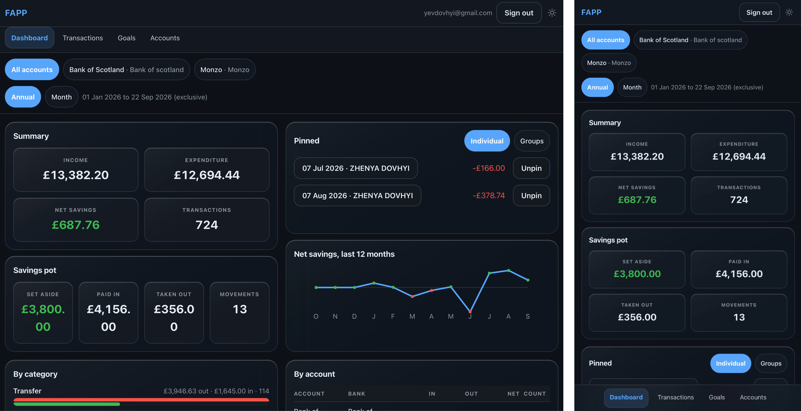
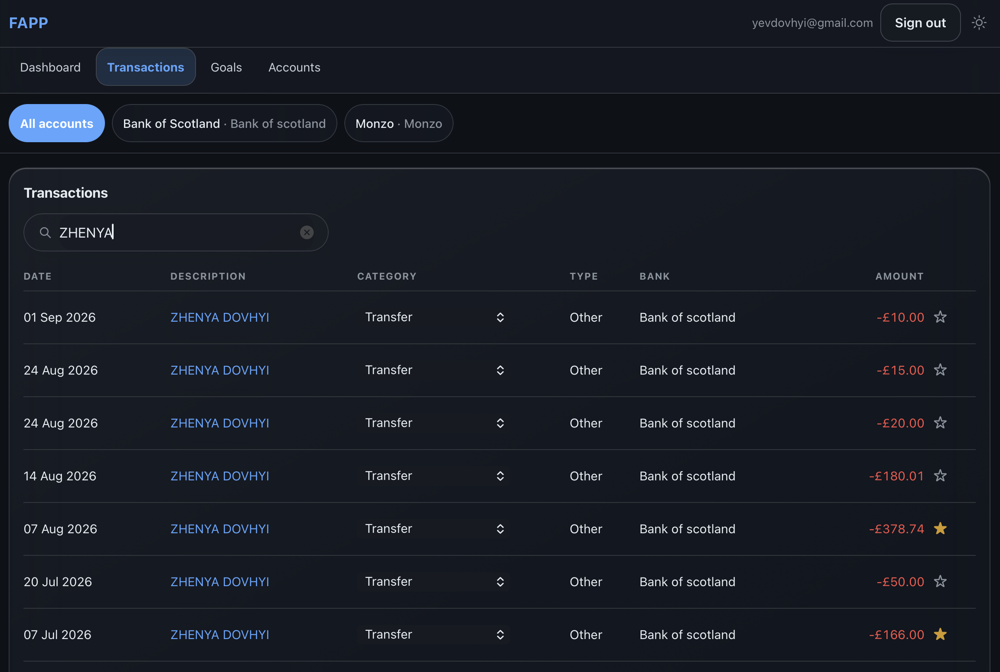
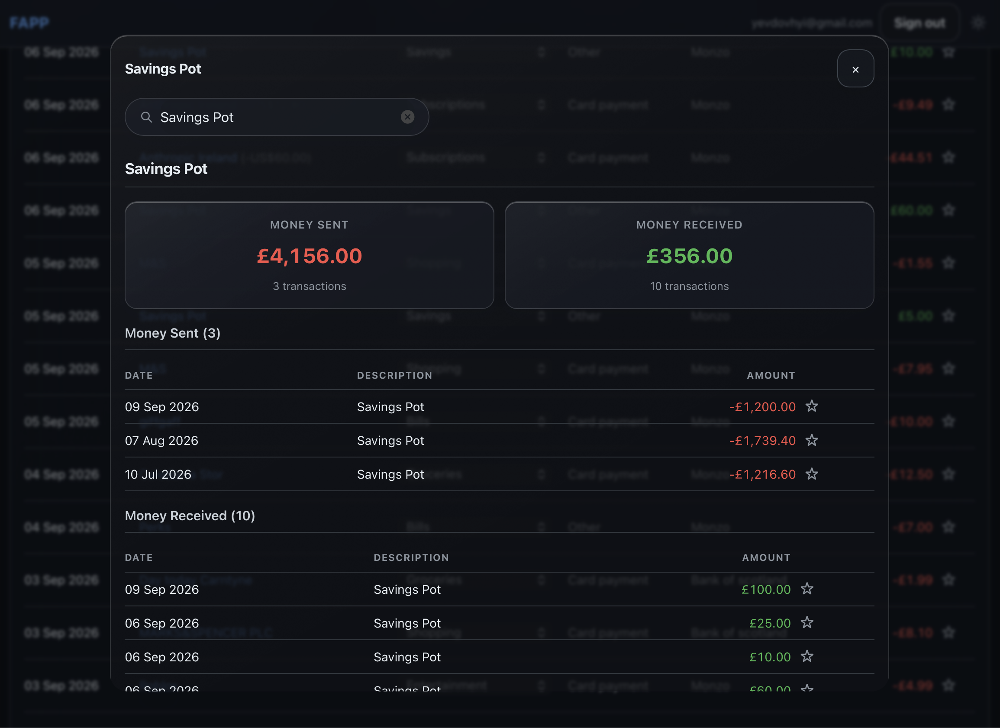
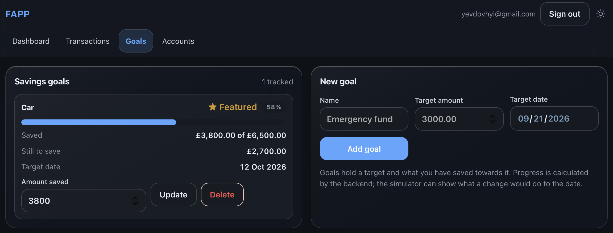
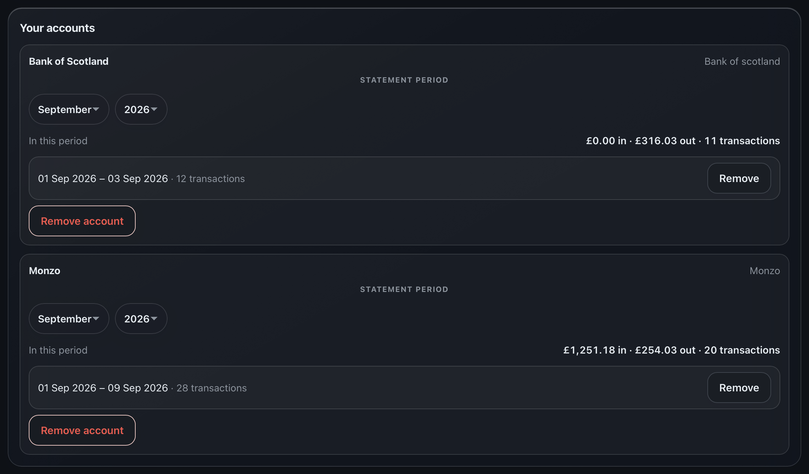

# FAPP - Financial Analysis & Planning Platform

A full-stack personal finance dashboard that pulls transactions from multiple UK bank accounts into one consistent view, categorises and analyses them, and tracks progress towards savings goals.

## The problem it solves

Using more than one bank at once, such as Bank of Scotland and Monzo, means financial reality is split across separate apps, separate CSV formats and separate category names, with no combined view.

FAPP imports each bank's statement through a bank-specific adapter, normalises it into a single transaction model, and helps users see what actually happens with their money.

## Screenshots







## Running locally

**Requirements:** Java 21, Node 20+, and Docker with Compose plugin.

```bash
# 1. Clone repository and build
git clone https://github.com/evgg12/FAPP.git
docker compose up -d

# 2. Backend API (Flyway applies migrations on startup)
./mvnw spring-boot:run
```

The API starts on `http://localhost:8080`. Swagger UI is available at `http://localhost:8080/swagger-ui.html`.

```bash
# 3. Frontend, in a second terminal
cd frontend
npm install
npm run dev
```

Open `http://localhost:5173`. Create an account, add a bank account (choose Monzo or Bank of Scotland), and import a CSV statement exported from your bank.

Verify the setup:
```bash
curl http://localhost:8080/api/health
# {"status":"UP","application":"fapp"}
```

**Running tests:**

```bash
./mvnw test                   # Backend tests; requires Docker for Testcontainers
cd frontend && npm test       # Frontend tests
cd frontend && npm run build  # Type-check, then build to dist/
```

## Technology stack

| Area | Technology |
|---|---|
| Language | Java 21 |
| Backend | Spring Boot 3.5 (Web, Data JPA, Validation, Security) |
| Database | PostgreSQL 17, schema owned by Flyway migrations |
| Build | Maven (via Maven Wrapper) |
| Backend testing | JUnit 5, AssertJ, Testcontainers |
| Frontend | React 19, TypeScript 5.9, Vite 7 |
| Frontend testing | Vitest, Testing Library |
| API documentation | OpenAPI 3.0, Swagger UI, springdoc-openapi |
| Deployment | Docker, Docker Compose, nginx |

## Testing & CI

Automated testing covers the backend, frontend, API security, data imports and financial logic.

| Area | Tools | Coverage |
|---|---|---|
| Backend | JUnit 5, AssertJ, Testcontainers | Domain, persistence, REST API, security, imports, analytics |
| Frontend | Vitest, React Testing Library | Components and UI behaviour |
| Static checks | TypeScript | Type safety |
| Build | Maven, Vite | Production build verification |
| CI | GitHub Actions | Backend and frontend checks on PRs and pushes to `main` |

The backend test suite runs against PostgreSQL through Testcontainers. GitHub Actions runs the backend test suite with `./mvnw verify` and verifies the frontend tests, TypeScript compilation and production build.

## API documentation

FAPP exposes a documented REST API using OpenAPI 3.0 and provides a Swagger UI for interactive exploration.

**Local development**: start the backend and visit `http://localhost:8080/swagger-ui.html`. Every endpoint, parameter, request body and response is documented inline.

Analytics endpoints take `from` (inclusive) and `to` (exclusive) date parameters and an optional `accountId`. Errors return a stable code and message, e.g. `USER_NOT_FOUND`, `INVALID_DATE_RANGE`, `MIXED_CURRENCY_ACCOUNTS`, `DUPLICATE_STATEMENT`, `VALIDATION_FAILED`.

## Notes

Built by [Yevhenii Dovhyi](https://github.com/evgg12) as a personal finance tool and software engineering portfolio project.

Repository: [github.com/evgg12/FAPP](https://github.com/evgg12/FAPP)
